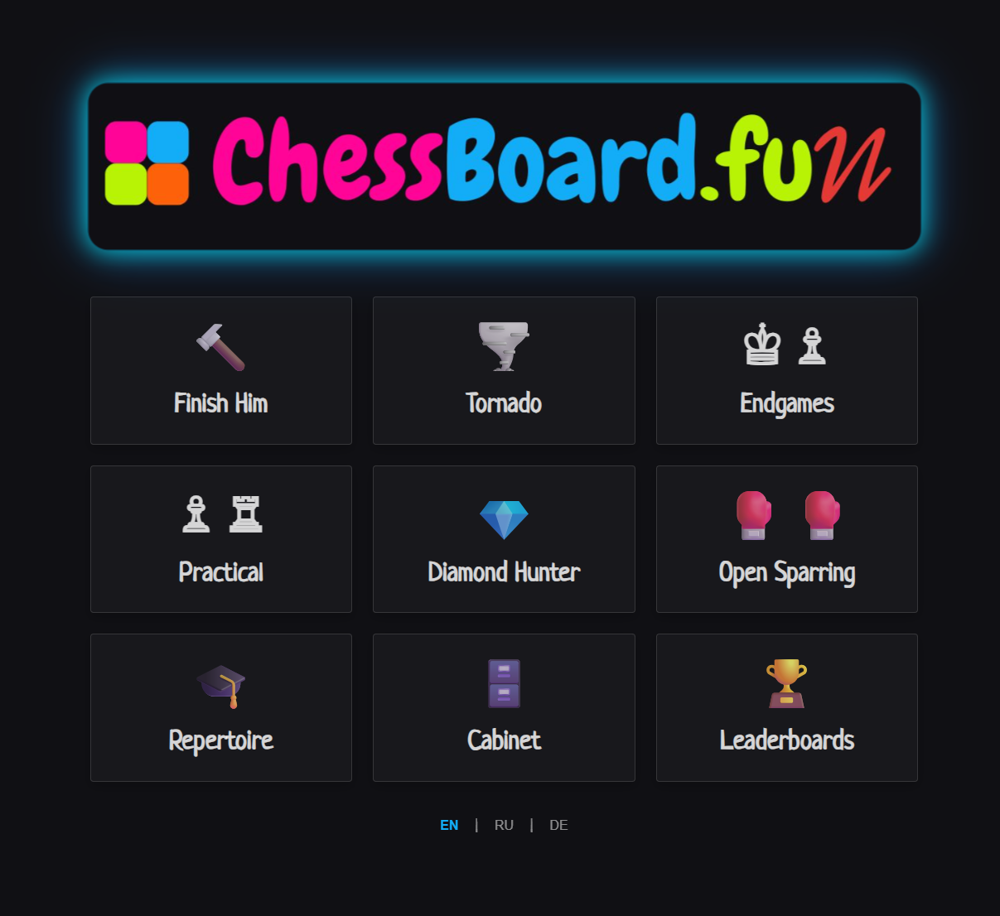
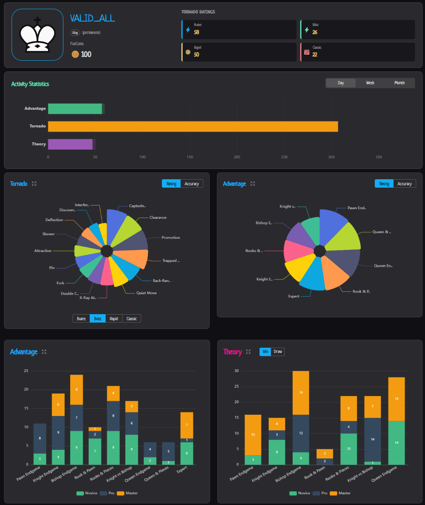
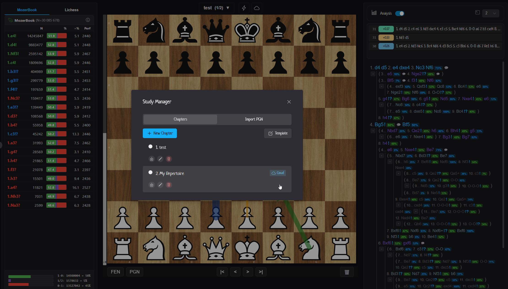
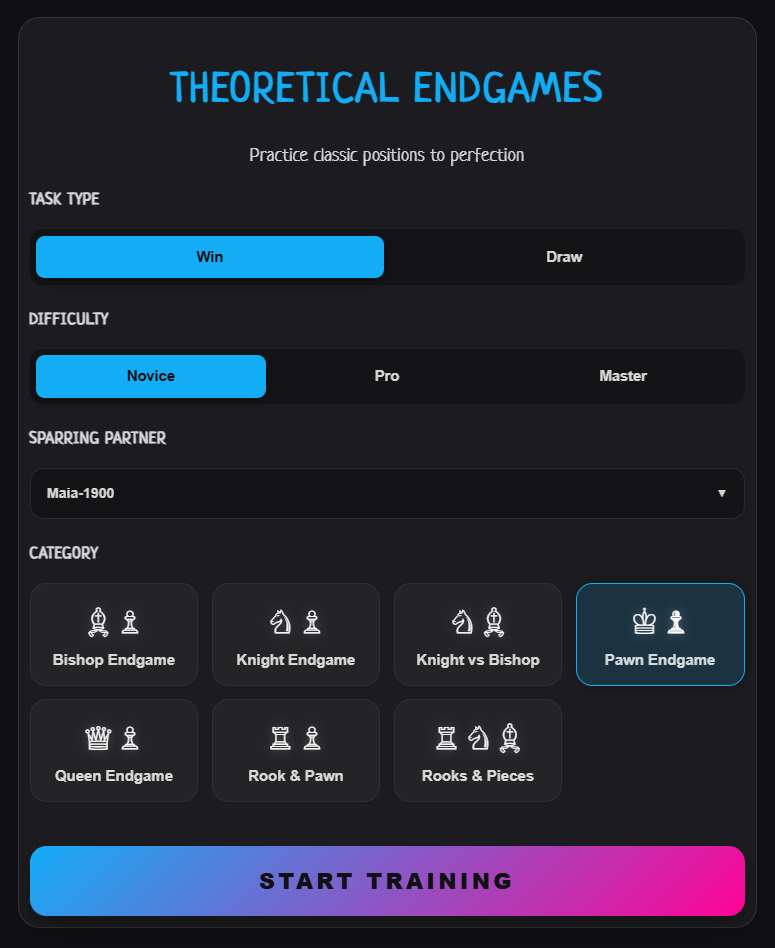
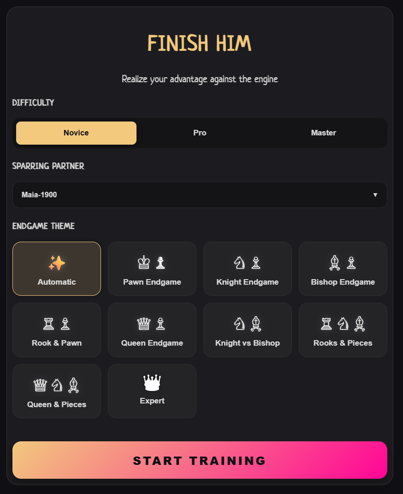
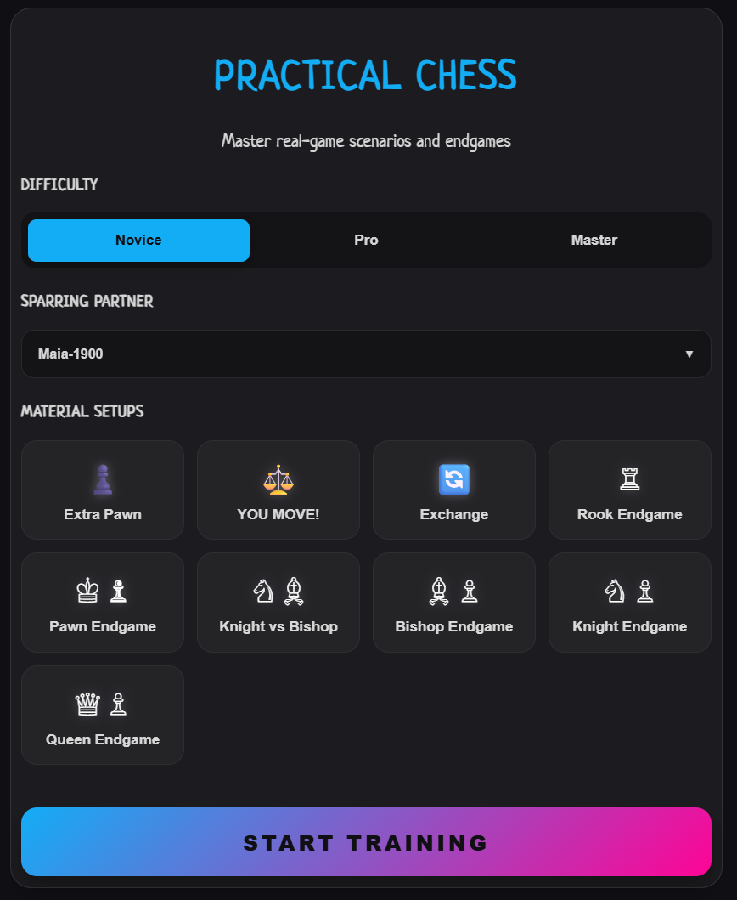
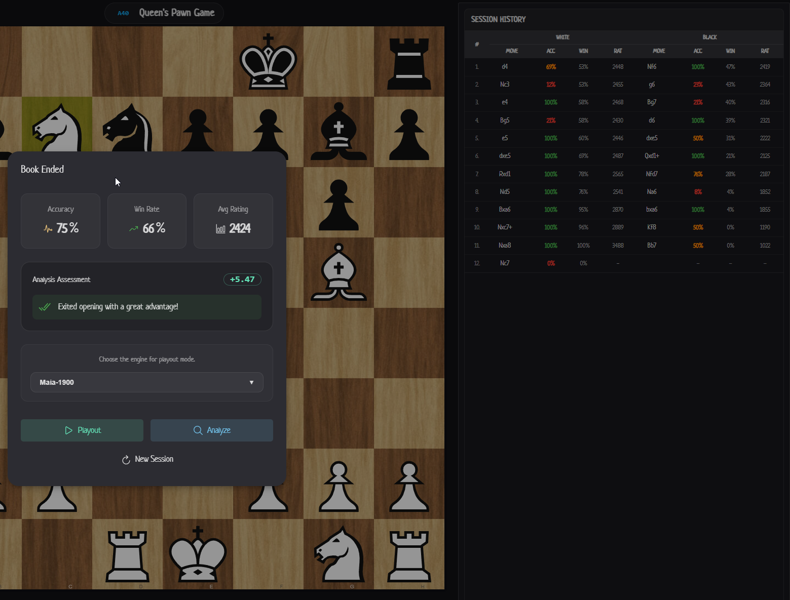

# ♟️ Chessboard.fun — Professional Chess Training Ecosystem

**Bridge the gap between amateur play and Grandmaster-level preparation.**

**Chessboard.fun** is a high-performance interactive platform designed for chess enthusiasts who seek a disciplined, professional-grade training environment. We combine deep engine-backed analysis with realistic, human-like AI resistance to transform study into a repeatable, high-impact skill.

  

---

## 🚀 The Vision: Depth over Simplicity

> "I've always dreamed of a tool that doesn't just show you the engine's best move, but teaches you how to *find* it, *convert* it, and *memorize* it." — **Moser**, Project Architect

Most chess platforms focus on casual play or simple puzzles. **Chessboard.fun** is different. We believe that true improvement requires:
- **Analytical Depth**: Every position is verified by a distributed cluster of elite engines.
- **Human-Centric AI**: We use specialized neural networks (Maia) to simulate the mistakes, traps, and "stubbornness" of real human opponents.
- **The Memorization Loop**: It's not enough to find a brilliant move once; our "Secure" system ensures you internalize the logic forever.

---

## 💎 Flagship Features

### 🥇 Diamond Hunter (The Killer Feature)
Stop relying on luck to find brilliant moves. 
- **The "Hunt & Secure" Loop**: Find a Diamond (`!!`), refute the bot's blunder, and then **replay the entire game from memory** to secure your achievement.
- **Gravity Map Guidance**: Visualize tactical tension with real-time arrow-based gravity mapping and "Distance" metrics.

  

### 📊 Tactical Fingerprint (User Cabinet)
Raw data transformed into actionable insights via **Apache ECharts**.
- **Nightingale Rose Charts**: A visual DNA of your tactical strengths and weaknesses across dozens of themes (Pins, Forks, X-Rays, etc.).
- **Mastery Ladder**: Stacked column charts tracking your progress through three tiers (**Novice**, **Pro**, **Master**) in every endgame and opening category.

  

> **🔗 Live Experience:** [Explore the User Cabinet Demo](https://chessboard.fun/user-cabinet/example)

---

## 🎮 Training Ecosystem

| Mode | Focus | Engine & Intelligence |
| :--- | :--- | :--- |
| **🌪️ Tornado** | Speed & Pattern Recognition | High-intensity time-assault (1m to 10m) |
| **⚔️ Finish Him** | Conversion Technique | Play positions with +2.0 advantage until Mate |
| **📖 Open Sparring** | Strategic Preparation | Interactive debut study with "Remote Commentator" |
| **📘 Repertoire** | Theory Architecture | Infinite-depth study trees integrated with **MozerBook** |
| **🧩 Practical** | Calculation & Intuition | Real-game "messy" endgames with side selection |
| **🎓 Theoretical** | Fundamental Endgames | Structured mastery of classic endgame positions |

### Professional Study Tools

  
  

- **Interactive Opening Sparring**: Train your repertoire against the engine with real-time feedback and theoretical notes from **MozerBook**.
- **Specialized Endgames**: Master precision in both theoretical basics and practical "messy" endgames.

  
  
  

---

## 🤖 AI & Engine Architecture

Our infrastructure utilizes a distributed engine cluster to provide specialized computations for every training scenario.

  

| Engine | Role | Playstyle |
| :--- | :--- | :--- |
| **Stockfish 18** | Absolute Truth | Mathematically perfect, optimal for strict "best" moves. |
| **Maia 1900/2200** | Human Sparring | Simulates realistic human errors and rating-specific patterns. |
| **BadGyal 8** | Tactical Aggressor | High-impact, sharp movements for tactical classification. |
| **MozerBook** | Theoretical Hub | Curated database of opening theory and statistical winrates. |

---

## 🌍 Economy & Club Integration

We operate on an **"Active-First"** model that rewards community engagement over passive consumption.
- **FunCoins**: Power your high-intensity engine playouts and advanced analytics.
- **Lichess Club Bonus**: Earn automatic tier upgrades (**Knight**, **Bishop**, **Rook**) by participating in club tournaments and being an active player.
- **Verification**: All achievements are verified and linked directly to your **Lichess profile**.

> **🏆 Hall of Fame:** [Check the Current Leaders & Records](https://chessboard.fun/records/example)

---

## 🛠️ Technical Stack

- **Frontend**: Vue.js 3.5+ (Composition API), TypeScript (Strict), Vite, Pinia, Naive UI.
- **Backend Orchestration**: NestJS (Node.js) & FastAPI (Python).
- **Persistence**: Supabase (Postgres), IndexedDB (Dexie), LMDB (high-speed tactical lookups).
- **Core Libraries**: [Chessground](https://github.com/lichess-org/chessground) (Rendering) and [Chessops](https://github.com/niklasf/chessops) (Logic).
- **Nervous System**: [n8n.io](https://n8n.io/) visual workplace automation.

---

## 📚 Technical Documentation

Explore our deep-dive documentation for modular details:
1. [Project Overview](tech_docs/01_Project_Overview_Mission.md)
2. [Technical Stack](tech_docs/02_Technical_Stack.md)
3. [Architecture Overview](tech_docs/03_Architecture_Overview.md)
4. [Game Modes Deep-Dive](tech_docs/04_GameModes_Overview.md) (Details on [Diamond Hunter](tech_docs/04_5_Diamond_Hunter.md), [Tornado](tech_docs/04_2_Tornado.md), etc.)
5. [User Ecosystem & Economy](tech_docs/05_3_Monetization_Economy.md)
6. [Acknowledgments & Credits](tech_docs/06_DANKSAGUNG.md)

---

## ❤️ About the Author & Acknowledgments

**Moser** — A mechanical engineer and lifelong chess enthusiast. **Chessboard.fun** represents the convergence of modern AI and a long-held dream to create professional-grade training tools.

Special thanks to the [Lichess.org](https://lichess.org) team, the **Stockfish** project, **LCZero**, and **Maia Chess** for the foundational tools that make this platform possible.

_License: GNU General Public License v3.0 | Made with ❤️ for the global chess community._

