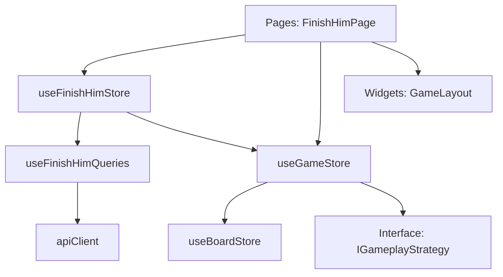

# Логическое ядро: Finish Him

Режим **Finish Him** предназначен для отработки навыка реализации решающего преимущества. Игрок получает позицию с перевесом и должен довести её до мата против компьютерного противника.

## 1. Схема взаимодействия (Flow)

1.  **Selection:** Пользователь выбирает тему (например, "King Side Attack") и сложность в `EndingSelectionPage` (путь `/finish-him`).
2.  **Loading:** `FinishHimView` при монтировании вызывает `loadNewPuzzle`. `useFinishHimStore` инициирует запрос через `puzzleQuery.refetch()` (используя `apiClient`).
3.  **Strategy Setup:** Стор фичи создает объект `IGameplayStrategy` через фабрику `_createStrategy` и передает его в `useGameStore.startWithStrategy`.
4.  **Gameplay:** 
    - `useGameStore` управляет циклом ходов.
    - Ответные ходы бота генерируются либо из `tactical_solution` (сценарий), либо через `gameplayService.getBestMove` (Stockfish/Mozer), если сценарий исчерпан или нарушен.
5.  **Validation:** После каждого хода `GameStore` проверяет состояние доски. При завершении вызывается `strategy.onGameOver`.
6.  **Reporting:** `FinishHimStore` обрабатывает завершение, проигрывает звуки и отправляет результат на бэкенд через `resultMutation`.

## 2. Структура данных и API

### Объект FinishHimPuzzle
Данные приходят от эндпоинта `/finish-him/start` или `/finish-him/PuzzleId/{id}`:

| Поле | Тип | Описание |
| :--- | :--- | :--- |
| `puzzle_id` | `string` | Уникальный ID пазла (обязателен для репортинга результата). |
| `initial_fen` | `string` | Начальная позиция на доске. |
| `tactical_solution` | `string` | Сценарная линия: UCI-ходы, разделенные пробелом (например, `"e2e4 e7e5 f1c4"`). |
| `engm_rating` | `number` | Внутренний рейтинг сложности (EGM). |
| `category` | `string` | Тематическая категория (например, `pawn`, `queen`). |

**Важно:** Сценарная линия ходов (`tactical_solution`) парсится в массив `string[]` внутри стратегии.

## 2. Ключевые компоненты и их задачи

### [Feature] useFinishHimStore (`src/features/finish-him/model/finishHim.store.ts`)
- **Управление состоянием:** Хранит активный пазл, параметры выбора (тема, сложность) и состояние обработки GameOver.
- **Фабрика стратегии:** Инкапсулирует логику конкретно этого режима в объект `IGameplayStrategy`.
- **Сообщения (Feedback):** Формирует локализованные подсказки через `feedbackMessage`.
- **Интеграция с API:** Использует `useFinishHimQueries` для сетевого взаимодействия. Обновляет профиль пользователя (`authStore.updateUserStats`) после успешной отправки результата.
- **Звуковое сопровождение:**
    - `app_game_entry`: при инициализации режима.
    - `game_user_won` / `game_user_lost`: при финальном результате.

### [Entity] useGameStore (`src/entities/game/model/game.store.ts`)
- **Движок игры:** Универсальный контроллер, который принимает стратегию и исполняет её.
- **Управление фазами:** Переключает состояния `IDLE` -> `LOADING` -> `PLAYING` -> `GAMEOVER`.
- **Оркестрация ходов:** Вызывает `handleUserMove` на доске, проверяет мат и запрашивает ответ бота у стратегии.

### [Entity] useBoardStore (`src/entities/game/model/board.store.ts`)
- **Chess Core:** Работа с `chessops`, валидация ходов, генерация FEN/PGN.
- **Звуки доски:** `board_move`, `board_capture` и т.д. (автоматически при применении хода).

## 3. Подробная логика взаимодействия (Связка)

1.  **User Move:** `WebChessBoard` -> `GameLayout.handleUserMove` -> `gameStore.handleUserMove`.
2.  **Strategy Validation:** Если в стратегии есть `validateUserMove`, ядро спрашивает разрешение на ход.
3.  **Board Update:** Ход применяется в `boardStore`.
4.  **Deviation Control (в стратегии Finish Him):**
    - В `onUserMoveExecuted` сравнивается ход игрока с `expectedMove` из сценария.
    - Если ходы не совпадают — `isPlayoutMode` становится `true`, проигрывается звук `game_play_out_start`.
5.  **Bot Response:** `gameStore` вызывает `strategy.requestBotMove`. 
    - Если `isPlayoutMode == false`, возвращается следующий ход из сценария.
    - Если `isPlayoutMode == true`, запрашивается живой расчет у `gameplayService` (Stockfish/Mozer).
6.  **GameOver:** Когда `boardStore.getGameStatus()` возвращает `isGameOver: true`, ядро вызывает `strategy.onGameOver`.

## 4. Особенности бизнес-логики

### Экономика (PawnCoins)
- **Списание:** Происходит на бэкенде при вызове эндпоинта `/start`.
- **Ошибка 402:** Если монет недостаточно, `apiClient` выбрасывает `InsufficientPawnCoinsError`. Стор перехватывает её и показывает модальное окно с предложением перейти в магазин.

### Условие победы
- Победителем считается игрок, поставивший мат (`outcome.winner === humanColor`). 
- Пат, ничья или сдача (Resign) интерпретируются как поражение в контексте задачи "Finish Him" (реализация перевеса не достигнута).

### Интеграция с анализом
- В `FinishHimView` настроен вотчер на `gamePhase`. При переходе в `GAMEOVER` автоматически вызывается `analysisStore.showPanel()`, позволяя пользователю разобрать ошибки или альтернативные пути.

## 5. Зависимости и структура (FSD)

**Ключевое изменение после рефакторинга:**
Логика режима полностью отделена от ядра доски. `useGameStore` ничего не знает о "пазлах" или "сценариях" — он просто выполняет команды, которые дает ему стратегия, предоставленная фичей `finish-him`.
