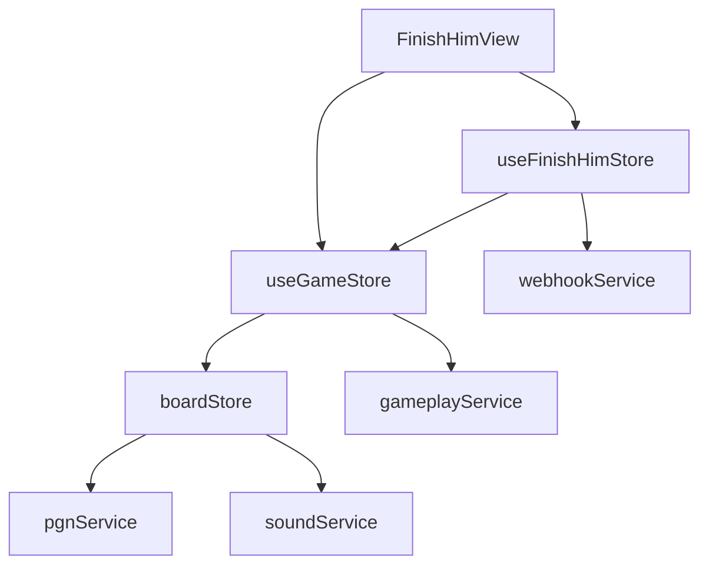

# Логическое ядро: Finish Him

Режим **Finish Him** предназначен для отработки навыка реализации решающего преимущества. Игрок получает позицию с перевесом и должен довести её до мата против компьютерного противника.

## 1. Схема взаимодействия (Flow)

1.  **Selection:** Пользователь выбирает тему (например, "King Side Attack") и сложность в `FinishHimSelection`.
2.  **Loading:** `useFinishHimStore` запрашивает пазл у API (`webhookService.fetchFinishHimPuzzle`).
3.  **Handover:** Стор фичи передает управление в `useGameStore` через `setupPuzzle`, делегируя низкоуровневую обработку шахматной логики.
4.  **Gameplay:** 
    - `useGameStore` управляет очередностью ходов.
    - Ответные ходы бота генерируются либо из сценария пазла, либо через `gameplayService` (Stockfish/Mozer).
5.  **Validation:** После каждого хода вызывается `_checkWinCondition` (проверка мата).
6.  **Reporting:** При завершении `_handleGameOver` отправляет результат на бэкенд для обновления статистики и рейтинга Glicko-2.

## 2. Структура данных и API

### Объект FinishHimPuzzle
Интерфейс данных, получаемый от `webhookService.fetchFinishHimPuzzle`:

| Поле | Тип | Описание |
| :--- | :--- | :--- |
| `puzzle_id` | `string` | Уникальный ID пазла (обязателен для репортинга результата). |
| `initial_fen` | `string` | Начальная позиция на доске. |
| `tactical_solution` | `string` | Сценарная линия: UCI-ходы, разделенные пробелом (например, `"e2e4 e7e5 f1c4"`). |
| `engm_rating` | `number` | Внутренний рейтинг сложности (EGM). |
| `category` | `string` | Тематическая категория (например, `pawn`, `queen`). |

**Важно:** Сценарная линия ходов (`tactical_solution`) парсится фронтендом в массив `string[]` при вызове `setupPuzzle`.

## 2. Ключевые компоненты и их задачи

### [Feature] useFinishHimStore (`src/features/finish-him/model/finishHim.store.ts`)
- **Управление состоянием:** Хранит ID текущего пазла, выбранную тему и сложность.
- **Сообщения (Feedback):** Формирует локализованные подсказки ("Ваш ход", "Вы победили" и т.д.).
- **Интеграция с API:** Вызывает методы `webhookService` для получения данных и сохранения результатов.
- **Обработка GameOver:** Решает, как именно завершилась игра для конкретного режима (победа/поражение/сдача).
- **Звуковое сопровождение (Game-Level):**
    - `app_game_entry`: при входе в режим.
    - `game_user_won` / `game_user_lost`: при финальном результате (в `_handleGameOver`).

### [Entity] useGameStore (`src/entities/game/model/game.store.ts`)
- **Технический цикл:** Реализует паттерн "Strategy" для разных игровых режимов.
- **Scenario Moves:** Отрабатывает жестко заданные ходы из пазла (если они есть), прежде чем переключиться на живой расчет движком.
- **Управление фазами:** Переключает состояния `IDLE` -> `LOADING` -> `PLAYING` -> `GAMEOVER`.
- **Взаимодействие с Ботом:** Вызывает `gameplayService.getBestMove` и передает результат в `boardStore`.

### [Entity] useBoardStore (`src/entities/game/model/board.store.ts`)
- **Chess Core:** Инкапсулирует библиотеку `chessops` для валидации ходов и генерации FEN.
- **Звуковое сопровождение (Board-Level):** (Метод `_playSoundsForMove`)
    - `board_move`, `board_capture`, `board_promote`: базовые шахматные звуки.
    - `board_check`, `board_checkmate`, `board_draw_*`: звуки состояния игры (могут быть отключены флагом `playGameStatusSounds`).
- **Синхронизация с PGN:** Каждый ход автоматически передается в `pgnService`.

## 3. Подробная логика взаимодействия (Связка)

Процесс совершения хода в режиме Finish Him:

1.  **User UI -> boardStore.handleUserMove:** Шахматная доска (Chessground) инициирует движение фигуры. `boardStore` проверяет легальность хода через `chessops`.
2.  **boardStore -> pgnService:** Если ход легален, он записывается в историю.
3.  **boardStore -> SoundService:** Издается звук `board_move` или `board_capture`.
4.  **GameStore.handleUserMove:** Получает подтверждение, что ход сделан. Проверяет, не является ли этот ход "сценарным" (из пазла).
5.  **Validation:** `GameStore` опрашивает `boardStore.getGameStatus()`. Если на доске мат — вызывается коллбэк победы в `FinishHimStore`.
6.  **Bot Response:** Если игра продолжается, `GameStore` запрашивает ход у `gameplayService`. Тот, в свою очередь, обращается к серверному Mozer или локальному Stockfish.
7.  **Bot Move -> boardStore.applyUciMove:** Полученный ход применяется к доске, запуская цикл звуков и PGN-записей заново.

## 4. Особенности бизнес-логики

### Контроль отклонений (Deviation Control)
Во время "сценарной" фазы (пока не исчерпаны ходы из `tactical_solution`) система работает по следующему алгоритму:
1. Игрок делает ход.
2. `GameStore.handleUserMove` сравнивает UCI-код хода со следующим ходом в сценарии.
3. **Если ход совпадает:** Индекс сценария увеличивается, игра продолжается по плану.
4. **Если ход отличается (но легален):** 
   - Сценарий немедленно прерывается.
   - Индекс `currentScenarioMoveIndex` устанавливается в конец массива.
   - Система мгновенно переходит в фазу "плейаут" (живая игра против движка).
   - Издается звук `game_play_out_start`.
   - Ответный ход генерируется движком (`Stockfish/Mozer`) из текущей (новой) позиции.

**Итог:** Ход игрока никогда не отклоняется системой (нет "неправильных" ходов, если они по правилам шахмат), но "рельсы" сценария отключаются при первом же отклонении.

### Экономика и Транзакционность (FunCoins)
- **Атомарность:** Списание FunCoins и получение данных пазла происходит на стороне бэкенда в рамках одного запроса `fetchFinishHimPuzzle`.
- **Обработка ошибок:**
  - Если запрос завершился сетевой ошибкой (`Network Error`), FunCoins на бэкенде не списываются (или транзакция откатывается базой данных).
  - Стор фичи перехватывает ошибку, выводит уведомление `loadFailed` и не вызывает `setupPuzzle`.
  - Механизм "отката" на фронтенде не требуется, так как баланс пользователя (`authStore.userProfile.FunCoins`) обновляется только при успешном ответе сервера или следующем запросе профиля.
- **Недостаточно средств:** Если у пользователя 0 монет, сервер возвращает статус `402 (Payment Required)`, который обрабатывается в сторе вызовом модального окна покупки.

### Прочие правила
- **Условие победы:** Строго мат со стороны игрока. Патовые ситуации или ничьи интерпретируются как поражение (т.к. преимущество не реализовано).
- **Плейаут (Playout):** Если "сценарные" ходы пазла закончились, но мат не поставлен, игра переходит в режим свободного доигрывания против движка.
- **Статистика:** Обновление статистики (`_updateAndSendStats`) происходит асинхронно после завершения игры. В случае ошибки отправки результата, данные о победе могут быть потеряны (очередь оффлайн-отправки пока не реализована).
- **Раздельный рейтинг:** Статистика побед/поражений сохраняется отдельно для каждой сложности (`Novice`, `Pro`, `Master`).
- **Интеграция с анализом:** После завершения игры (`isGameOver`), `FinishHimView` автоматически вызывает `analysisStore.showPanel()`. Это позволяет пользователю разобрать альтернативные пути реализации преимущества с помощью мощного облачного или локального движка. Панель анализа скрывается при загрузке нового пазла.

## 5. Зависимости и FSD-риски

**Критическое замечание для Ревизора:**
Связка `useGameStore` и `useBoardStore` имеет признаки сильной связанности (tight coupling). `GameStore` знает о деталях `boardStore`, а `boardStore` берет на себя логику звуков состояний игры, которая в идеале должна контролироваться режимом. Также `boardStore` напрямую зависит от `pgnService` (Shared layer), что делает его "тяжелым" объектом.

## 6. Краткое резюме по Finish Him:

Режим завязан на useFinishHimStore, который является высокоуровневой оберткой над универсальным useGameStore.
Ключевая особенность — переход от "сценарных" ходов (из БД) к "живому" доигрыванию (против Stockfish), если мат не был поставлен сразу.
Бизнес-логика (рейтинги, оплата за попытки) инкапсулирована в фиче, не загрязняя сущности.
