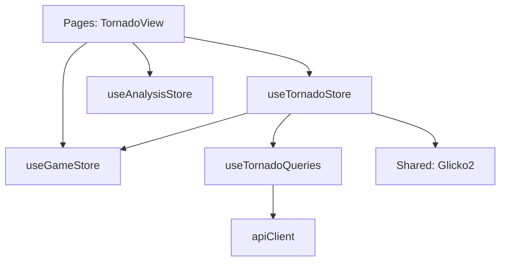

# Логическое ядро: Tornado

Режим **Tornado** (Ураган) — это соревновательный режим решения тактических задач на время. Игрок должен решить как можно больше задач, пока не истечет время.

## 1. Схема взаимодействия (Flow)

1.  **Start session:** Пользователь выбирает формат времени (`bullet`, `blitz`, `rapid`, `classic`) на странице выбора.
2.  **Prefetch:** `startSession` в `useTornadoStore` вызывает `startSessionMutation`. Бэкенд возвращает `basket` (корзину) пазлов и `sessionId`.
3.  **Tornado Loop:**
    - Из корзины выбирается пазл, рейтинг которого наиболее близок к текущему `sessionRating` игрока (`_popBestPuzzle`).
    - Устанавливается через `setupPuzzle`, который создает стратегию для `gameStore`.
    - Таймер запускается после **первого** хода игрока.
4.  **Result Handling:**
    - При совершении хода вызывается `onUserMoveExecuted` в стратегии.
    - **Если верно:** `handlePuzzleResult(true)` добавляет время (инкремент), рейтинг Glicko-2 пересчитывается локально, берется следующий пазл.
    - **Если ошибка:** `handlePuzzleResult(false)` не добавляет время, рейтинг падает, пазл сохраняется в `mistakenPuzzles`, берется следующий пазл.
5.  **Session End:** По истечении времени или сдаче вызывается `_handleSessionEnd`, отправляя накопленный массив `pendingResults` на сервер через `endSessionMutation`.

## 2. Техническая спецификация и Ресурсы

### Корзина пазлов (Rainbow Basket)
- **Инициализация:** При вызове `/tornado/start/...` бэкенд возвращает сформированный пул задач, сбалансированный по рейтингу.
- **Локальный подбор:** Фронтенд самостоятельно выбирает пазл из корзины на основе текущего рейтинга сессии, что исключает сетевые задержки между задачами.

### Сетевые сбои и Транзакционность
- **Накопление данных:** Результаты записываются в `pendingResults`.
- **Синхронизация:** Обновление глобального рейтинга и хайскоров происходит в конце игры (`endSessionMutation`). При успехе вызывается `authStore.updateUserStats` для синхронизации профиля.
- **Локальный кеш:** Ошибочные задачи (`mistakenPuzzles`) немедленно сохраняются в `localStorage` (`tornado_mistakes`).

### Тайминг и Анимация (Bot Delay)
- **Задержка ответа:** Для тактических пазлов бот ходит мгновенно. В `gameStore` используется задержка по умолчанию `50мс`, что достаточно для отрисовки анимации хода игрока в Chessground перед ходом бота.

## 2. Ключевые компоненты и их задачи

### [Feature] useTornadoStore (`src/features/tornado/model/tornado.store.ts`)
- **Управление сессией:** Таймер (`setInterval`), локальный рейтинг (Glicko-2), управление корзиной пазлов.
- **Интеграция с API:** Использует `useTornadoQueries`.
- **Звуковое сопровождение:**
    - `board_timer_10s` / `board_timer_8s`: предупреждения.
    - `board_timer_times_up`: конец времени.
    - `game_tacktics_success` / `game_tacktics_error`: результат задачи.

### [Entity] useGameStore (`src/entities/game/model/game.store.ts`)
- **Execution:** Принимает стратегию от Торнадо и исполняет ходы. В этом режиме ядро работает в ускоренном цикле.

### [Entity] useBoardStore (`src/entities/game/model/board.store.ts`)
- **Silent Mode:** При старте сессии вызывается `setPlayGameStatusSounds(false)`, чтобы стандартные звуки мата/шаха не мешали звукам успеха/ошибки режима.

## 3. Подробная логика взаимодействия (Связка)

1.  **Start:** `TornadoStore` сбрасывает состояние и запрашивает сессию.
2.  **Puzzle Setup:** Для каждой задачи создается временная стратегия.
3.  **Timer Flow:** Таймер стартует в `onUserMoveExecuted` при первом ходе.
4.  **Instant Feedback:** Как только ход игрока проверен, `handlePuzzleResult` мгновенно обновляет UI, звуки и переключает пазл.
5.  **Clean up:** При выходе или завершении звуки доски возвращаются в стандартный режим.

## 4. Особенности бизнес-логики

- **Инкремент времени:** Добавляется за каждый правильный ответ.
- **Mistakes Persistence:** Список ошибок доступен в `localStorage`, что позволяет перейти на страницу `/tornado/mistakes` для разбора задач.
- **Блокировка анализа:** Панель анализа (`AnalysisPanel`) принудительно скрывается во время активной сессии через `AnalysisStore` для предотвращения читерства и концентрации на скорости.

## 5. Зависимости и структура (FSD)

**Резюме:**
Режим Торнадо — самый требовательный к производительности и отзывчивости UI. Использование локального хранилища пазлов ("корзины") и локального расчета рейтинга позволяет минимизировать влияние сетевых задержек на игровой процесс.
