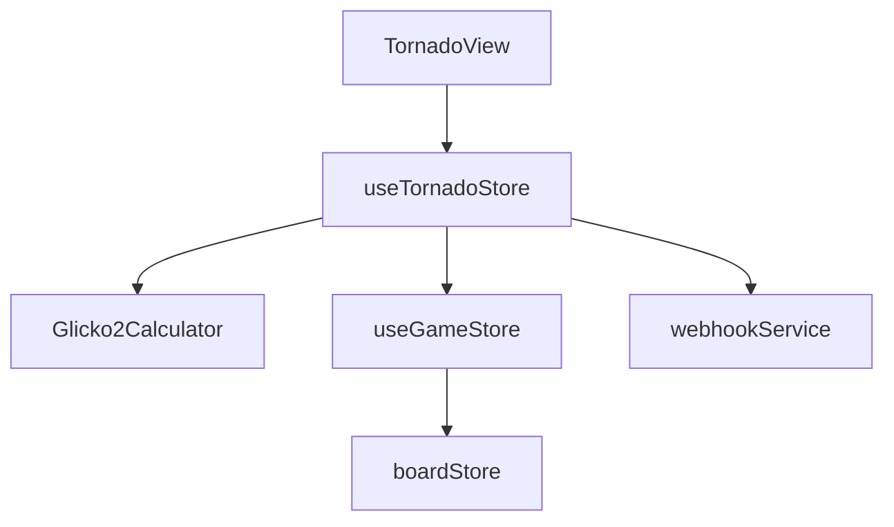

# Логическое ядро: Tornado

Режим **Tornado** (Ураган) — это соревновательный режим решения тактических задач на время. Игрок должен решить как можно больше задач, пока не истечет время.

## 1. Схема взаимодействия (Flow)

1.  **Start session:** Пользователь выбирает формат времени (`bullet`, `blitz`, `rapid`, `classic`).
2.  **Prefetch:** `startTornadoSession` возвращает `basket` (корзину) пазлов разной сложности и `sessionId`.
3.  **Tornado Loop:**
    - Из корзины выбирается пазл, рейтинг которого наиболее близок к текущему `sessionRating` игрока (`_popBestPuzzle`).
    - Устанавливается через `gameStore.setupPuzzle`.
    - Таймер запускается после **первого** хода игрока.
4.  **Result Handling:**
    - При совершении хода (верного или неверного) вызывается `handlePuzzleResult`.
    - **Если верно:** добавляется время (инкремент), рейтинг Glicko-2 растет, берется более сложный пазл.
    - **Если ошибка:** время не добавляется, рейтинг падает, пазл сохраняется в `mistakenPuzzles`, берется более легкий пазл.
5.  **Session End:** По истечении времени или сдаче вызывается `endTornadoSession`, отправляя накопленный массив `pendingResults` на сервер.

## 2. Техническая спецификация и Ресурсы

### Корзина пазлов (Rainbow Basket)
- **Инициализация:** При вызове `startTornadoSession` бэкенд возвращает сформированный пул задач ("Rainbow Basket"), сбалансированный по рейтингу и темам сессии.
- **Истощение ресурсов:** Фронтенд **не реализует** механизм фонового докачивания (background fetch). Если корзина пустеет до завершения таймера (что маловероятно при нормальных объемах выборки), игра переходит в состояние ожидания (`loadingMorePuzzles`), но новые запросы не отправляются.
- **Синхронизация:** Размер корзины рассчитывается на стороне бэкенда исходя из выбранного контроля времени.

### Сетевые сбои и Транзакционность
- **Накопление данных:** Все результаты решения задач записываются асинхронно в массив `pendingResults` в памяти браузера.
- **Риски:** Обновление глобального рейтинга Glicko-2 и запись истории сессии происходят **единоразово** в конце игры (`endTornadoSession`). В случае обрыва соединения или закрытия вкладки в этот момент, весь накопленный прогресс рейтинга в текущей сессии будет потерян на сервере.
- **Локальный кеш:** Ошибочные задачи (`mistakenPuzzles`) немедленно сохраняются в `localStorage` (`tornado_mistakes`). Это единственный тип данных, защищенный от сбоя сети, что позволяет пользователю проводить "работу над ошибками" даже после неудачной синхронизации сессии.

### Синхронизация UI и Анимаций (Bot Bypass)
- **Задержка ответа:** Ответный ход бота (в сценарной фазе) жестко ограничен задержкой `BOT_MOVE_DELAY_MS = 50`.
- **Rationnale:** 50 мс — критический интервал, позволяющий Vue.js произвести пересчет виртуального DOM (Virtual DOM patch) после хода игрока и дать браузеру один кадр на отрисовку анимации Chessground. Это устраняет визуальные артефакты, когда фигура бота "телепортируется" до завершения анимации хода игрока.
- **Цикл событий:** Использование `async/await` с `setTimeout` помещает ход бота в конец очереди макрозадач, гарантируя корректное завершение текущего тика реактивности.

## 2. Ключевые компоненты и их задачи

### [Feature] useTornadoStore (`src/features/tornado/model/tornado.store.ts`)
- **Управление временем:** Реализует `window.setInterval` для таймера.
- **Звуковое сопровождение (Game-Level):**
    - `board_timer_10s` / `board_timer_8s`: критические предупреждения о времени.
    - `board_timer_times_up`: при обнулении таймера.
    - `game_tacktics_success` / `game_tacktics_error`: мгновенная реакция на результат пазла.
- **Локальный Glicko-2:** Использует `Glicko2Calculator` для мгновенного предсказания сложности.

### [Entity] useGameStore (`src/entities/game/model/game.store.ts`)
- **Tornado Mode Logic:** Работает в режиме "мгновенного фидбека".
- **Коллбэки:** Передает управление в `TornadoStore` через `onGameOver` (в данном случае — конец одного пазла) и `onCorrectFirstMove`.
- **Bot Bypass:** В отличие от Finish Him, здесь бот ходит мгновенно (50мс задержка), чтобы не тратить время игрока.

### [Entity] useBoardStore (`src/entities/game/model/board.store.ts`)
- **Silent Mode:** Принудительно отключает свои звуки состояния (`playGameStatusSounds = false`), чтобы они не перебивали звуки Успеха/Ошибки самого Торнадо.
- **Навигация:** Используется для мгновенной очистки доски и постановки новой позиции.

## 3. Подробная логика взаимодействия (Связка)

1.  **Start:** `TornadoStore` вызывает `boardStore.setPlayGameStatusSounds(false)`.
2.  **Move Execution:** Когда игрок делает ход, `boardStore` проверяет его и издает звук `board_move`.
3.  **Instant Validation:** `GameStore` ловит результат. Если ход не совпал со сценарием — мгновенно вызывается `handlePuzzleResult(false)` в Торнадо сторе.
4.  **Chain Reaction:**
    - `TornadoStore` играет `game_tacktics_error`.
    - `TornadoStore` обновляет локальный рейтинг.
    - `TornadoStore` выбирает новый пазл из корзины.
    - `TornadoStore` вызывает `gameStore.setupPuzzle`.
    - `GameStore` вызывает `boardStore.setupPosition`.
5.  **Timer Flow:** `TornadoStore` управляет временем независимо, но `GameStore` сигнализирует о первом ходе, чтобы запустить отсчет.

## 4. Специфическая шахматная логика

- **Auto-pop:** Выбор следующего пазла происходит мгновенно. `gameStore` в этом режиме работает как высокоскоростной конвейер позиций.
- **Selection Algorithm:** `_popBestPuzzle` реализует жадный поиск пазла с минимальной разницей в рейтинге от текущего состояния игрока в рамках текущего пула.
- **Mistakes Persistence:** Все ошибки дублируются в `localStorage` («tornado_mistakes»), что позволяет восстановить список пазлов для реванша даже после перезагрузки страницы.
- **Интеграция с анализом:** Во время активной сессии панель анализа принудительно скрывается, чтобы игрок фокусировался на скорости. Глубокий анализ доступен в режиме `Mistakes`, где пользователь может спокойно разобрать каждую нерешенную задачу с движком.

## 5. Зависимости и FSD-риски

**Критическое замечание для Ревизора:**
В режиме Торнадо связка магазинов работает на пределе: `TornadoStore` вынужден напрямую манипулировать поведением `BoardStore` (отключать звуки), что является нарушением инкапсуляции. Также высокая частота вызовов `setupPuzzle` создает нагрузку на реактивность Vue, что может приводить к микро-фризам на слабых устройствах.

## 5. Краткое резюме по Tornado:

Tornado — это высоконагруженный по логике режим, требующий мгновенной реакции UI. 
Главная архитектурная находка — разделение на "Корзину" (получается один раз от сервера) и "Локальный мозг" (пересчитывает рейтинг и выбирает пазл из корзины без запросов к API). Это обеспечивает бесшовный игровой процесс даже при плохом соединении. Статистика синхронизируется только в самом конце, что делает сессию уязвимой для сетевых сбоев, но максимально отзывчивой в процессе игры.
