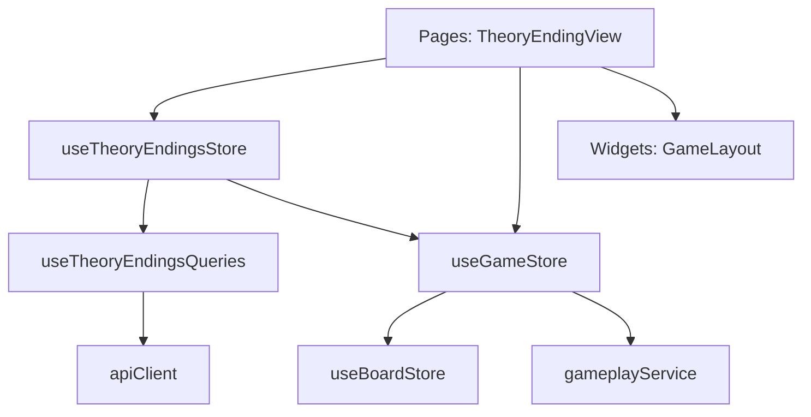

# Логическое ядро: Theory Endings

Режим **Theory Endings** (Теоретические окончания) предназначен для отработки техники реализации или защиты в типовых эндшпилях. В отличие от тактики, здесь нет единственно верного пути (сценария), важен только конечный результат.

## 1. Схема взаимодействия (Flow)

1.  **Selection:** Пользователь выбирает категорию, сложность и тип задачи (Win — выиграть, Draw — удержать ничью) в `EndingSelectionPage`.
2.  **Position Setup:** `TheoryEndingsStore` запрашивает позицию через `puzzleQuery`.
    - Если тип `win`, игрок всегда играет за белых (сильнейшая сторона).
    - Если тип `draw`, игрок играет за слабейшую сторону. Цвет определяется по полю `weak_side`. Если `weak_side === 'even'`, цвет выбирается случайно.
3.  **Pure Playout:** `GameStore` инициализирует доску через `startWithStrategy` с пустой сценарной логикой.
4.  **Bot Interaction:** Бот начинает играть в полную силу (через `gameplayService.getBestMove`) с первого же хода.
5.  **Dynamic Win Condition:** По завершении партии (мат, пат, сдача) стратегия сверяет фактический результат с ожидаемым.

## 2. Техническая реализация и Точность

### Движок и Таблицы Налимова
- **Tablebases:** В текущей версии `gameplayService` использует Stockfish/Mozer. Хотя прямой поддержки Syzygy Tablebases на фронтенде нет, мощь движка на глубине 15+ позволяет безошибочно разыгрывать типовые окончания.
- **Ограничения:** Режим ориентирован на практическое доигрывание, где игрок должен доказать свое преимущество или оборонительные навыки против сильного AI.

### Контракт завершения партии
`TheoryEndingsStore` получает вердикт о завершении через `onGameOver` стратегии. Статус содержит `outcome` от `BoardStore`:
- `checkmate` — мат.
- `stalemate` — пат.
- `insufficient_material` — недостаточность материала.
- `fifty_move_rule` — правило 50 ходов.
- `threefold_repetition` — трехкратное повторение.
- `resign` — добровольная сдача.

## 2. Ключевые компоненты и их задачи

### [Feature] useTheoryEndingsStore (`src/features/theory-endings/model/theoryEndings.store.ts`)
- **Параметризация:** Хранит контекст текущего упражнения (тип, сложность, категория).
- **Логика успеха:** Переопределяет стандартное понятие "победы" в методе `checkWinCondition`.
- **API:** Использует `useTheoryEndingsQueries` для получения пазлов и отправки результатов.
- **Звуковое сопровождение:**
    - `game_user_won` / `game_user_lost`: при финальном результате.

### [Entity] useGameStore (`src/entities/game/model/game.store.ts`)
- В этом режиме выступает как классический движок игры против AI.
- Стратегия не содержит сценарных ходов, поэтому `requestBotMove` всегда вызывает `gameplayService.getBestMove`.

### [Entity] useBoardStore (`src/entities/game/model/board.store.ts`)
- Обеспечивает выполнение шахматных правил, критичных для эндшпиля (50 ходов, повторение и т.д.).

## 3. Подробная логика взаимодействия (Связка)

Процесс игры в Theory Endings:

1.  **Загрузка:** `TheoryEndingsStore` получает пазл -> создает стратегию -> `gameStore.startWithStrategy`.
2.  **Вердикт (checkWinCondition):** 
    - Если `activeType === 'win'`: успех, если `outcome.winner === humanColor` и `outcome.reason === 'checkmate'`.
    - Если `activeType === 'draw'`: успех, если `outcome.winner === humanColor` (игрок выиграл) ИЛИ `outcome.winner === undefined` (любая ничья).
3.  **Обработка GameOver:** При достижении финала проигрывается звук и отправляется результат на бэкенд для обновления статистики.

## 4. Особенности бизнес-логики

- **Сдача (Resignation):** Сдача игрока всегда трактуется как **проигрыш**, даже в режиме "Draw".
- **Интеграция с анализом:** После окончания упражнения в `TheoryEndingView` автоматически открывается `AnalysisPanel` при переходе в фазу `GAMEOVER`.

## 5. Зависимости и структура (FSD)

**Резюме:**
Режим Theory Endings является наиболее «чистым» примером использования паттерна Стратегия, где фича полностью переопределяет правила интерпретации результата игры, сохраняя при этом стандартный игровой цикл.
