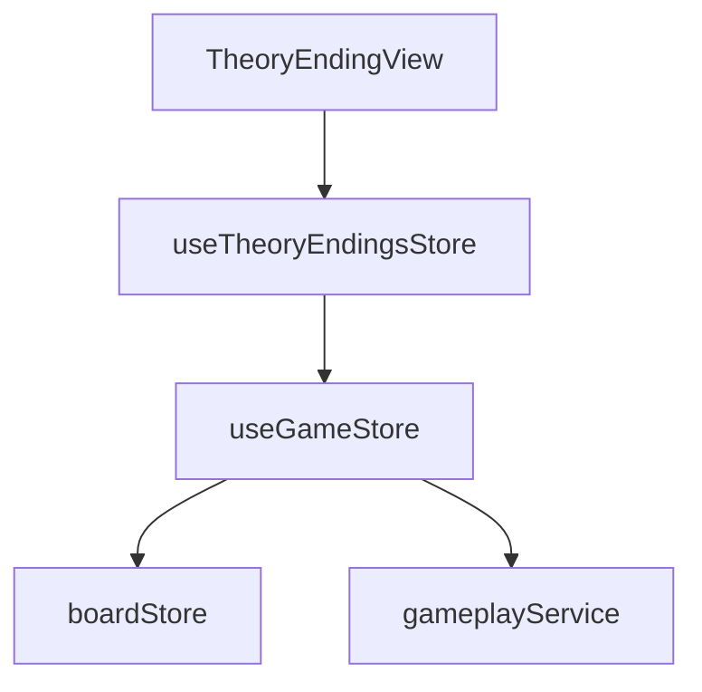

# Логическое ядро: Theory Endings

Режим **Theory Endings** (Теоретические окончания) предназначен для отработки техники реализации или защиты в типовых эндшпилях. В отличие от тактики, здесь нет единственно верного пути (сценария), важен только конечный результат.

## 1. Схема взаимодействия (Flow)

1.  **Selection:** Пользователь выбирает категорию (например, "Pawn Endings"), сложность и тип задачи (Win — выиграть, Draw — удержать ничью).
2.  **Position Setup:** `TheoryEndingsStore` запрашивает позицию.
    - Если тип `win`, игрок всегда играет за сильнейшую сторону.
    - Если тип `draw`, игрок играет за слабейшую сторону (цвет определяется по полю `weak_side` в пазле).
3.  **Pure Playout:** `GameStore` инициализирует доску через `setupPuzzle` с **пустым** массивом сценария.
4.  **Bot Interaction:** Бот начинает играть в полную силу (через `gameplayService`) с первого же хода.
5.  **Dynamic Win Condition:** По завершении партии (мат, пат, сдача) `TheoryEndingsStore` сверяет фактический результат с ожидаемым теоретическим статусом через объект `outcome`.

## 2. Техническая реализация и Точность

### Движок и Таблицы Налимова
- **Tablebases:** В текущей версии `gameplayService` (и локальный Stockfish) **не подключен** к Syzygy Tablebases.
- **Точность:** Гарантия корректной игры бота в эндшпиле обеспечивается динамической глубиной поиска (SF Depth 10-15). В позициях с малым числом фигур (3-6) это позволяет движку удерживать теоретически ничейные позиции за счет встроенных эвристик оценки материала и активности, не прибегая к внешним базам данных.
- **Риски:** На экстремально сложных эндшпилях (например, мат конем и слоном), где требуется маневрирование более чем в 50 ходов, отсутствие таблиц гипотетически может привести к ошибке бота, но это нивелируется ограничением сложности пазлов в базе данных.

### Контракт завершения партии
`TheoryEndingsStore` получает вердикт о завершении через метод `boardStore.getGameStatus()`. Статус содержит строгий Enum причин:
- `checkmate` — мат.
- `stalemate` — пат.
- `insufficient_material` — недостаточность материала.
- `fifty_move_rule` — правило 50 ходов.
- `threefold_repetition` — трехкратное повторение.
- `resign` — добровольная сдача.

Парсинг PGN-строк для определения результата **не используется**, что исключает ошибки интерпретации.

## 2. Ключевые компоненты и их задачи

### [Feature] useTheoryEndingsStore (`src/features/theory-endings/model/theoryEndings.store.ts`)
- **Параметризация:** Хранит контекст текущего упражнения (тип, сложность, категория).
- **Логика успеха:** Переопределяет стандартное понятие "победы". Например, в режиме 'draw' ничья против компьютера — это победа игрока.
- **Звуковое сопровождение (Game-Level):**
    - `game_user_won` транслирует сообщение "Ничья удержана!" или "Мат поставлен!", в зависимости от контекста.

### [Entity] useGameStore (`src/entities/game/model/game.store.ts`)
- В этом режиме выступает как классический движок игры против AI.
- Не выполняет поиск по сценарию, сразу делегирует расчет хода `gameplayService`.

### [Entity] useBoardStore (`src/entities/game/model/board.store.ts`)
- Обеспечивает выполнение шахматных правил, критичных для эндшпиля:
    - Правило 50 ходов.
    - Трехкратное повторение позиции.
    - Недостаточность материала.
- Все эти состояния корректно обрабатываются методом `getGameStatus`.

## 3. Подробная логика взаимодействия (Связка)

Процесс игры в Theory Endings:

1.  **Загрузка:** `TheoryEndingsStore` получает FEN -> `GameStore.setupPuzzle(fen, [], ...)` -> `BoardStore.setupPosition(fen)`.
2.  **Ход игрока:** `BoardStore` валидирует ход, `pgnService` записывает его.
3.  **Ход бота:** `GameStore` видит, что очередь хода бота и сценарий пуст -> вызывает `gameplayService.getBestMove`.
4.  **Движок:** `gameplayService` использует Stockfish/Mozer для нахождения оптимального ответа в эндшпиле.
5.  **Завершение:** Когда `BoardStore.getGameStatus()` возвращает `isGameOver: true`, управление возвращается в `TheoryEndingsStore._handleGameOver`.
6.  **Вердикт:** 
    - Если `activeType === 'win'` и на доске мат боту -> **Success**.
    - Если `activeType === 'draw'` и на доске любая ничья (пат, 50 ходов и т.д.) или победа игрока -> **Success**.
    - В остальных случаях -> **Failure**.

## 4. Особенности бизнес-логики

- **Сдача (Resignation):** Если пользователь нажимает "Сдаться" (Resign), это передается в `outcome.reason`. В `_checkWinCondition` сдача всегда трактуется как **проигрыш**, даже в режиме "Draw". Это сделано для предотвращения абуза: пользователь обязан доказать способность удержать ничью на доске.
- **Случайный цвет:** Если в пазле `weak_side` указан как `even`, система случайно назначает игроку белых или черных (для тренировки защиты за оба цвета).
- **Интеграция с анализом:** После окончания упражнения пользователю всегда предлагается `AnalysisPanel`, чтобы разобрать допущенные ошибки в технике эндшпиля.

## 5. Зависимости и FSD-риски

**Критическое замечание для Ревизора:**
В режиме Theory Endings становится очевидным, что `GameStore` перегружен. Он должен уметь работать и как "проигрыватель сценариев", и как "движок игры". Логика выбора между сценарием и живым расчетом в `_triggerBotMove` усложняет поддержку. Кроме того, `TheoryEndingsStore` вынужден дублировать часть логики определения цвета, которая могла бы быть более универсальной в `BoardStore`.

## 6. Краткое резюме по Theory Endings:

Этот режим — «испытание на прочность» для связки Game+Board, так как партии здесь самые длинные и сложные по правилам. Режим успешно переиспользует общую логику, но вводит кастомную интерпретацию результата (Draw = Success), что вынесено на уровень фичи.
