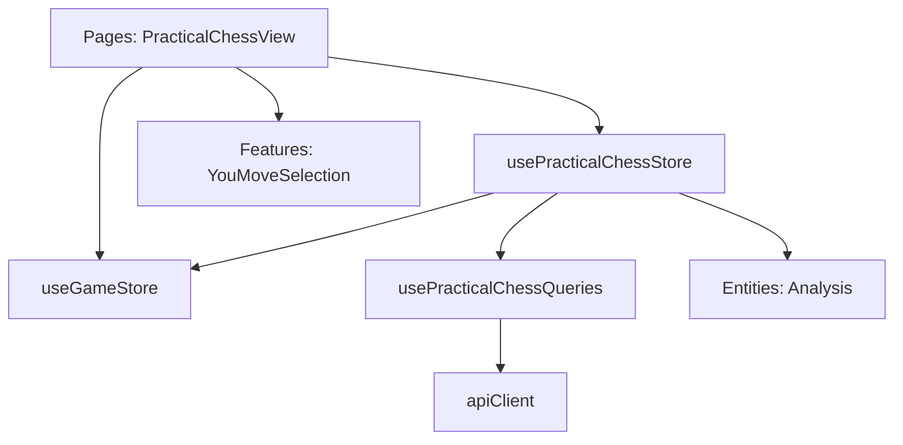

# Логическое ядро: Practical Chess

Режим **Practical Chess** (Практические эндшпили) предназначен для тренировки игры в позициях, взятых из реальной турнирной практики. Основной упор сделан на реализацию преимущества или удержание равных окончаний.

## 1. Схема взаимодействия (Flow)

1.  **Loading:** `PracticalChessStore` запрашивает позицию через `puzzleQuery`.
2.  **State Split:** 
    - Если категория — "Преимущество" (`extraPawn`, `exchange` и др.), игрок автоматически назначается за выигрывающую сторону.
    - Если категория — "Равенство" (`materialEquality`), включается режим **Color Selection**.
3.  **Color Selection Phase:**
    - Игровой цикл (`GameStore`) стоит на паузе (`IDLE`).
    - Вместо кнопок управления отображается `YouMoveSelection`.
    - Игрок может изучать позицию на доске, но ответные ходы бота не генерируются.
4.  **Activation:** После выбора цвета в `startYouMoveGame`:
    - Стор фичи модифицирует FEN (устанавливает очередь хода выбранного цвета).
    - Вызывается `gameStore.startWithStrategy`.
    - Проигрывается звук `game_you_move`.
5.  **Gameplay:** Идет полная игра против движка (Stockfish/Mozer) без сценариев.
6.  **GameOver:** Проверяется условие `outcome.winner === currentUserColor`.

## 2. Техническая реализация

### Манипуляции с FEN (Side-to-Move)
В режиме `materialEquality` игрок сам выбирает сторону. Технически это реализовано через строковую модификацию FEN в `usePracticalChessStore.startYouMoveGame`:
- Строка FEN разбивается по пробелам.
- Индекс `[1]` (очередь хода) заменяется на `'w'` или `'b'`.
- Библиотека `chessops` в `BoardStore` валидирует полученную строку при старте.

### Состояние доски в фазе Selection
Пока активно окно выбора цвета (`isWaitingForColorSelection`), игра находится в фазе `IDLE`.
- **Интерактивность:** Доска позволяет пользователю передвигать фигуры для анализа, но это не инициирует игровой цикл, так как стратегия еще не активна.
- **Сброс:** При нажатии кнопки выбора стороны вызывается `startWithStrategy`, который производит `setupPosition` и приводит доску к официальному начальному состоянию пазла с нужной очередью хода.

## 3. Ключевые компоненты и их задачи

### [Feature] usePracticalChessStore (`src/features/practical-chess/model/practicalChess.store.ts`)
- **FEN Manipulation:** Управление полем `turn` в FEN строке.
- **Conditional Logic:** Разделяет поведение для позиций с преимуществом и равных позиций.
- **API:** Использует `usePracticalChessQueries` для связи с бэкендом.
- **Звуковое сопровождение:**
    - `game_you_move`: при подтверждении выбора стороны.

### [UI] YouMoveSelection (`src/features/practical-chess/ui/YouMoveSelection.vue`)
- **Interruption UI:** Подменяет панель управления, пока не будет сделан выбор.

### [Entity] useGameStore (`src/entities/game/model/game.store.ts`)
- Выполняет роль пассивного исполнителя игровой сессии против AI.

## 4. Подробная логика взаимодействия (Связка)

1.  **Store Load:** Получение пазла -> `gameStore.setGamePhase('LOADING')`.
2.  **UI Switch:** В `PracticalChessView` отображается `YouMoveSelection`, если `isWaitingForColorSelection === true`.
3.  **User Choice:**
    - `startYouMoveGame(color)` -> модификация FEN -> `gameStore.startWithStrategy`.
4.  **Game Cycle:** Стандартная игра против `gameplayService.getBestMove`.
5.  **GameOver:** Вызов `_handleGameOver`, обновление профиля и принудительная установка цвета игрока в `analysisStore` для последующего разбора.

## 5. Особенности бизнес-логики

- **Интеграция с анализом:** После завершения игры `PracticalChessView` автоматически открывает `AnalysisPanel`.
- **Условие победы:** Строго победа игрока выбранным цветом. Ничьи в этом режиме (в отличие от Theory Endings) обычно трактуются как неудача в реализации.

## 6. Зависимости и структура (FSD)

**Резюме:**
Practical Chess — это гибкий режим, сочетающий в себе элементы свободного анализа и строгого игрового цикла. Он демонстрирует возможность управления шахматным состоянием (FEN) на уровне бизнес-логики фичи.
