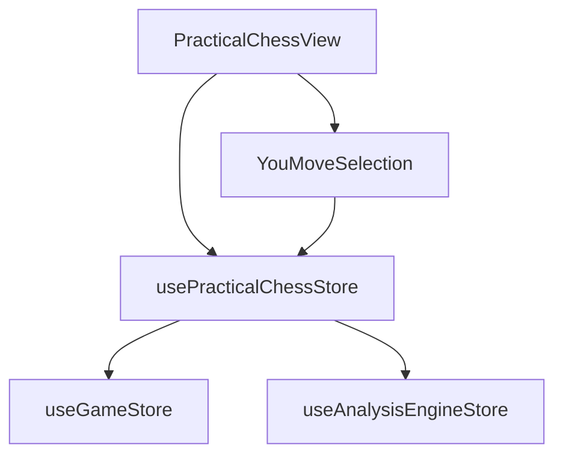

# Логическое ядро: Practical Chess

Режим **Practical Chess** (Практические эндшпили) предназначен для тренировки игры в позициях, взятых из реальной турнирной практики. Основной упор сделан на реализацию преимущества или удержание равных окончаний.

## 1. Схема взаимодействия (Flow)

1.  **Loading:** `PracticalChessStore` запрашивает позицию по категории и сложности.
2.  **State Split:** 
    - Если категория — "Преимущество" (`extraPawn` и др.), игрок автоматически назначается за выигрывающую сторону.
    - Если категория — "Равенство" (`materialEquality`), включается режим **Color Selection**.
3.  **Color Selection Phase:**
    - Игровой цикл (`GameStore`) стоит на паузе (`IDLE`).
    - Игрок видит позицию. Технически доска не заблокирована, но ходы не обрабатываются игровой логикой до подтверждения цвета.
    - Вместо кнопок управления отображается `YouMoveSelection` (Выбор стороны).
4.  **Activation:** После выбора цвета `PracticalChessStore` модифицирует FEN (если выбран черный цвет) и запускает `gameStore.setupPuzzle`.
5.  **Gameplay:** Идет полная игра против движка без сценариев.
6.  **GameOver:** Система проверяет, победил ли игрок выбранным цветом.

## 2. Техническая реализация

### Манипуляции с FEN (Side-to-Move)
В режиме `materialEquality` игрок сам выбирает сторону. Технически это реализовано через строковую модификацию FEN в `usePracticalChessStore.startYouMoveGame`:
- Строка FEN разбивается по пробелам.
- Индекс `[1]` (очередь хода) заменяется на `'w'` или `'b'`.
- **Безопасность:** Библиотека `chessops` валидирует полученную строку при вызове `setupPuzzle`. Если манипуляция привела к невалидному состоянию (например, неверное поле *En Passant* или король под шахом не той стороны), системный стор перехватывает ошибку и предотвращает запуск игры. 
- **Ограничение:** Данный подход безопасен только для позиций, где третье и четвертое поля FEN (рокировки и взятие на проходе) пусты или не зависят от очереди хода.

### Состояние доски в фазе Selection
Пока активно окно выбора цвета (`isWaitingForColorSelection`), игра находится в фазе `IDLE`.
- **Интерактивность:** Доска остается отзывчивой, позволяя пользователю "попробовать" ходы перед выбором цвета. Однако любые действия в этот момент являются «холостыми». 
- **Причина:** Коллбэки игровой логики (ответ бота, проверка победы) регистрируются в `GameStore` только в момент вызова `setupPuzzle`, который происходит **после** выбора цвета. До этого момента все изменения на доске хранятся только локально в `BoardStore` (или сбрасываются при `setupPuzzle`) и не влияют на игровой прогресс или статистику.

## 3. Ключевые компоненты и их задачи

### [Feature] usePracticalChessStore (`src/features/practical-chess/model/practicalChess.store.ts`)
- **FEN Manipulation:** Самостоятельно меняет флаг очереди хода в FEN строке при выборе черного цвета.
- **Conditional Logic:** Разделяет поведение системы для позиций с преимуществом и равных позиций.
- **Звуковое сопровождение (Game-Level):**
    - `game_you_move`: Воспроизводится в момент нажатия кнопки выбора стороны.

### [UI] YouMoveSelection (`src/features/practical-chess/ui/YouMoveSelection.vue`)
- **Interruption UI:** Блокирует стандартный поток управления, пока не будет сделан важный стратегический выбор (за кого играть).
- **Aesthetic:** Имеет яркий, акцентный дизайн ("YOU MOVE!"), подчеркивающий важность момента начала игры.

### [Entity] useGameStore (`src/entities/game/model/game.store.ts`)
- Работает как пассивный исполнитель. В этом режиме он просто транслирует UCI-ходы от игрока к `boardStore` и обратно от `gameplayService`.

## 4. Подробная логика взаимодействия (Связка)

Процесс старта в Practical Chess (на примере равной позиции):

1.  **Store Load:** Получение FEN -> `boardStore.setupPosition(fen)` (только визуально).
2.  **UI Switch:** `PracticalChessView` видит флаг `isWaitingForColorSelection` и отображает кнопки выбора цвета.
3.  **User Choice (Black):**
    - Стор фичи меняет `w` на `b` в FEN.
    - Издается звук `game_you_move`.
    - Вызывается `gameStore.setupPuzzle(modifiedFen, [], ...)`.
4.  **Bot Response:** Т.к. теперь очередь хода Черных (игрока), `GameStore` ждет хода пользователя. Если бы были выбраны Белые, бот сделал бы первый ход мгновенно.
5.  **Loop:** Игра до финала.

## 5. Особенности бизнес-логики

- **Интеграция с аналитикой:** При завершении игры `analysisStore.setPlayerColor` вызывается принудительно, чтобы при переходе в режим анализа движок понимал, за кого играл человек.
- **Статистика по категориям:** Результаты сохраняются на сервере с привязкой к категории (`materialEquality`, `extraPawn` и т.д.).

## 6. Зависимости и FSD-риски

**Критическое замечание для Ревизора:**
В этом режиме фича (`PracticalChessStore`) берет на себя роль низкоуровневого парсера FEN. Это тонкий момент — логика формирования шахматной позиции "утекает" из уровня сущностей (`entities`) на уровень фич. Также, прямое управление `analysisStore` из фичи практических шахмат создает перекрестную зависимость между фичами, что запрещено строгим FSD.

## 7. Краткое резюме по Practical Chess:

Practical Chess — «умный» режим, который умеет ждать решения игрока. Архитектурно он выделяется наличием фазы предварительного просмотра позиции до официального старта игрового цикла и ручной манипуляцией FEN-состоянием внутри стора фичи.
