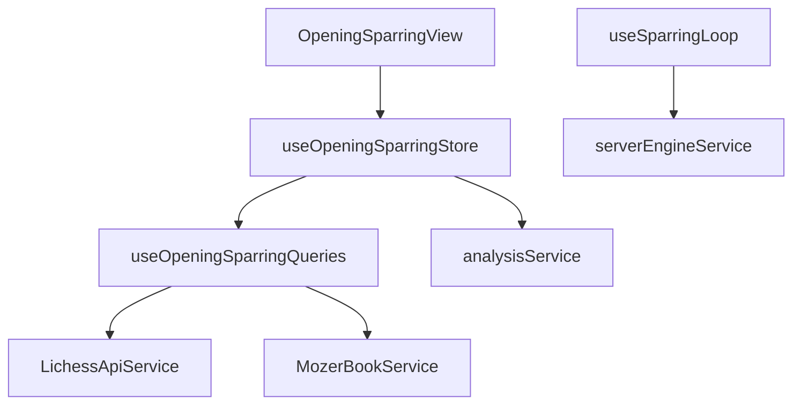

# Логическое ядро: Opening Sparring (Deep Audit)

Режим **Opening Sparring** — это гибридная система, сочетающая теорию дебютов и адаптивную игровую практику. Это единственный режим, где "сила" и "стиль" противника меняются динамически в зависимости от настроек и фазы игры.

## 1. Схема взаимодействия (Flow)

### Фаза А: Теория и Выбор Источника (Theory Source)
1.  **Configuration:** Игрок настраивает источник теоретических ходов:
    - **Master (Mozer Book):** Профессиональная база, отобранная кураторами.
    - **Lichess Explorer:** Статистика миллионов партий. Пользователь может выбрать **диапазон рейтингов** (от 1200 до 2200). 
2.  **Dynamic Bot:** Бот берет статистику из выбранного источника. Если выбран Lichess (1200), бот будет делать "человеческие" ошибки, характерные для этого рейтинга.
3.  **End of Theory:** Когда теория заканчивается (экспозиция достигнута или игрок свернул с линии), игра ставится на паузу.

### Фаза Б: Мост Анализа (Evaluation Gap)
1.  **Deep Analysis:** Позиция автоматически отправляется на глубокий анализ локальным многопоточным движком (Stockfish) до **глубины 20**.
    - **Интерфейс:** В этот момент отображается `OpeningSparringSummaryModal`. Модальное окно является блокирующим (`closable: false`), что предотвращает переход в другие состояния до завершения расчета.
    - **Прерывание:** Прямой кнопки "Отмена" нет. Процесс можно прервать только закрытием приложения (вкладки). При достижении глубины 20 или обнаружении мата, анализ останавливается автоматически через `analysisService.stopAnalysis()`.
2.  **Decision Point:** Пользователю выводится точная оценка (+/-). На этом этапе игрок решает: закончить тренировку или начать **Playout** (доигрывание).

### Фаза В: Плейаут против Спарринг-партнера
1.  **Partner Selection:** Если игрок выбирает доигрывание, он может выбрать конкретного спарринг-партнера:
    - **Maia 1900 / 2200:** Серверные нейросети, играющие в человеческом стиле.
    - **Badgyal-8:** Специфический агрессивный движок.
    - **Local Stockfish:** Игра на фиксированной глубине (обычно 10) для быстрой реакции.
2.  **Real-time Analysis:** Во время доигрывания каждый ход оценивается в реальном времени.
3.  **Post-Game:** Как и во всех режимах, после "Мата" или "Сдачи" доступен полный анализ локальным однопоточным движком.

## 2. Ключевые компоненты и их задачи

### [Feature] useOpeningSparringStore
- **Настройка оппонента:** Хранит `opponentSource` ('master'/'lichess') и `opponentRatings` (массив выбранных групп рейтинга).
- **Evaluation Engine:** Метод `runFinalEvaluation` управляет жизненным циклом глубокого анализа (инициализация воркера, установка потоков `navigator.hardwareConcurrency`, достижение целевой глубины 20).

### [Composable] useSparringLoop
- **Source-Aware Bot:** Метод `triggerBotMove` гибко переключается между `mozerQuery` и `lichessQuery`. Если выбран Lichess, бот имитирует игру в рамках выбранного диапазона рейтингов.
- **Async Queue:** `processMoveQueue` обеспечивает цепочку: Ход -> Получение статистики -> Сохранение в PGN -> Ход Бота.

### [Library] TheoryCacheService (`src/shared/api/TheoryCacheService.ts`)
- **Persistent Storage:** Использует **IndexedDB** (через библиотеку Dexie) для локального хранения ответов от Mozer Book и Lichess.
- **Performance:** При каждом ходе система сначала проверяет базу `OpeningDatabase`. Это позволяет мгновенно отрисовывать статистику и имена дебютов при повторных посещениях или движении по дереву PGN назад/вперед.

## 3. Подробная логика взаимодействия (Связка)

1.  **FEN Update:** `boardStore.fen` меняется.
2.  **Query Trigger:** Включается `useOpeningSparringQueries`.
    - Если `source === 'lichess'`, формируется запрос к Lichess API с фильтром по `ratings`.
3.  **Bot Strategy:** Бот видит распределение ходов. В режиме Lichess он может выбрать менее популярный ход, если так играют люди выбранного рейтинга.
    - **Таймауты API:** При отсутствии ответа от Lichess API (или Mozer) устанавливается `store.error`. Автоматического фолбэка на локальный бот *внутри теории* не происходит, так как теоретические ходы должны быть строго валидированы базой. Игра переходит в состояние ошибки до ручного перезапуска.
4.  **The Analysis Bridge:** При `isTheoryOver = true`, вызывается `analysisService.startAnalysis`. Это "стоп-кадр" в игре, где `GameStore` переходит в `IDLE`, пока не будет достигнута глубина 20.

## 4. Сложность и Движки (Mapping)

### Концепция рейтинга
Важно разделять влияние рейтинга Lichess (например, 1500) на разные фазы:
- **Фаза А (Теория):** Рейтинг 1500 используется как **фильтр выборки** из базы Lichess. Бот выбирает ответ среди ходов, которые реально делали люди с этим рейтингом.
- **Фаза В (Плейаут):** Рейтинг 1500 **не мапится** напрямую на настройки локального Stockfish (Skill Level). Вместо этого используется выбранный `engineId` в `gameplayService`:
    - По умолчанию: `MOZER_2000` (серверный).
    - Фолбэк (если сервер недоступен): Локальный Stockfish на **фиксированной глубине 8**.
- **Вывод:** Динамическая сложность доигрывания зависит от выбранного спарринг-партнера (Maia 1900/2200), а не от настройки фильтра теории.

## 4. Особенности звуковой системы и правил

- **game_you_move:** Звучит, когда начинается Плейаут (после выбора спарринг-партнера).
- **board_timer_10s/8s:** Используются, если сессия имеет ограничения (в некоторых подрежимах).

## 5. Зависимости и FSD-риски

**Критическое замечание для Ревизора:**
Opening Sparring — единственный режим, где "Логика бота" вынесена из стора в композабл (`useSparringLoop`), но при этом выбор движка для плейаута жестко зашит в вызовах API. Это создает архитектурный разрыв: настройки оппонента лежат в одном месте, а фактическая реализация его ходов — в другом.

## 6. Краткое резюме по Opening Sparring:

Это режим "три в одном": Репозиторий теории, Аналитическая станция и Игровой сервер. Уникальность заключается в возможности имитировать игру против широкого спектра человеческих рейтингов и обязательном этапе "Глубокого анализа" перед переходом к финальной стадии игры.
