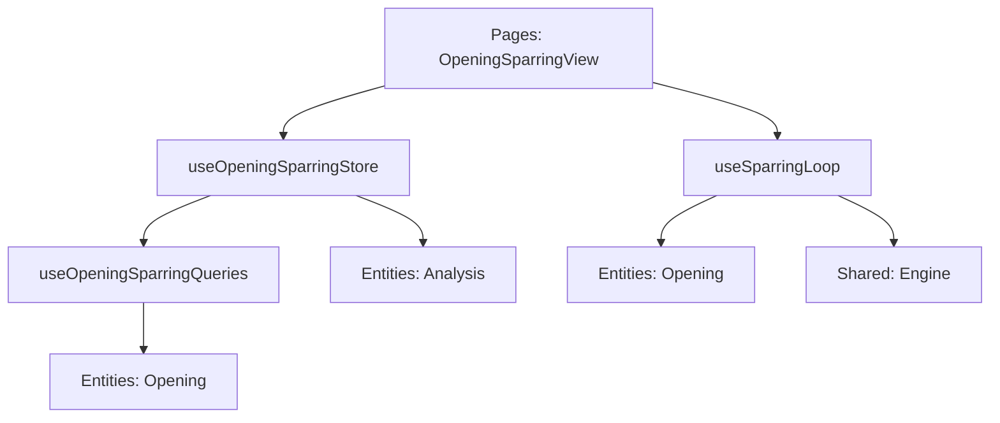

# Логическое ядро: Opening Sparring (Deep Audit)

Режим **Opening Sparring** — это гибридная система, сочетающая теорию дебютов и адаптивную игровую практику. Это единственный режим, где "сила" и "стиль" противника меняются динамически в зависимости от настроек и фазы игры.

## 1. Схема взаимодействия (Flow)

### Фаза А: Теория и Выбор Источника (Theory Source)
1.  **Configuration:** Игрок настраивает источник теоретических ходов:
    - **Master (Mozer Book):** Профессиональная база, отобранная кураторами.
    - **Lichess Explorer:** Статистика миллионов партий. Пользователь может выбрать **диапазон рейтингов** (от 1200 до 2200). 
2.  **Dynamic Bot:** Бот берет статистику из выбранного источника. Если выбран Lichess, бот выбирает свои ходы пропорционально их популярности среди игроков выбранного рейтинга, что позволяет имитировать "человеческие" дебютные предпочтения.
3.  **End of Theory:** Когда теория заканчивается (статистика ходов исчерпана или игрок совершил отклонение), игра переходит в фазу анализа.

### Фаза Б: Мост Анализа (Evaluation Gap)
1.  **Deep Analysis:** Позиция автоматически отправляется на глубокий анализ локальным движком (Stockfish) до **глубины 20**.
    - **Интерфейс:** Отображается `OpeningSparringSummaryModal`. Модальное окно является блокирующим (`closable: false`), предотвращая действия до завершения расчета.
2.  **Decision Point:** Пользователю выводится точная оценка (+/-). На этом этапе игрок решает: закончить тренировку или начать **Playout** (доигрывание).

### Фаза В: Плейаут против Спарринг-партнера
1.  **Partner Selection:** Игрок может выбрать конкретного спарринг-партнера (Maia, Stockfish и др.) в окне выбора.
2.  **Real-time Analysis:** Во время доигрывания каждый ход оценивается в реальном времени через `serverEngineService`.
3.  **Post-Game:** После завершения партии доступен полный разбор в режиме `ReviewMode`.

## 2. Ключевые компоненты и их задачи

### [Feature] useOpeningSparringStore (`src/features/opening-sparring/model/openingSparring.store.ts`)
- **Управление состоянием:** Хранит настройки источника, историю сессии (вычисляемую из PGN) и результаты анализа.
- **Deep Evaluation:** Метод `runFinalEvaluation` управляет жизненным циклом анализа до глубины 20 через `analysisService`.

### [Composable] useSparringLoop (`src/features/opening-sparring/model/useSparringLoop.ts`)
- **Core Loop:** Инкапсулирует логику переключения между теорией и плейаутом.
- **Bot Logic:** Метод `getTheoryBotMoveUci` динамически выбирает источник данных (Mozer/Lichess) для генерации хода бота.
- **PGN Enrichment:** Обогащает каждый ход в PGN метаданными (точность, популярность, оценка).

### [Entity] TheoryCacheService (`src/entities/opening/api/TheoryCacheService.ts`)
- **Persistent Storage:** Использует **IndexedDB** для кеширования ответов от Mozer Book и Lichess, обеспечивая мгновенную работу при повторных заходах в позицию.

## 3. Подробная логика взаимодействия (Связка)

1.  **Move:** Игрок делает ход -> Стратегия вызывает `onUserMoveExecuted`.
2.  **Enrichment:** `useSparringLoop.enrichUserMove` ищет данные хода в текущей базе и записывает их в PGN.
3.  **Bot Strategy:** `requestBotMove` вызывает `getTheoryBotMoveUci`. Если источник Lichess — используются данные `lichessQuery`.
4.  **Transition:** Если `isTheoryOver` становится `true`, `OpeningSparringView` инициирует `runFinalEvaluation`.

## 4. Особенности бизнес-логики

- **Имитация рейтинга:** В фазе теории рейтинг Lichess служит фильтром популярности. В фазе плейаута сложность определяется выбранным спарринг-партнером.
- **Review Mode:** Позволяет перемещаться по истории партии с включенным движком для анализа альтернатив.

## 5. Зависимости и структура (FSD)

**Резюме:**
Opening Sparring — самый архитектурно сложный режим, объединяющий внешние API, локальный шахматный движок и кеширование данных. Использование композабла `useSparringLoop` позволяет отделить сложную асинхронную логику игрового цикла от состояния стора.
