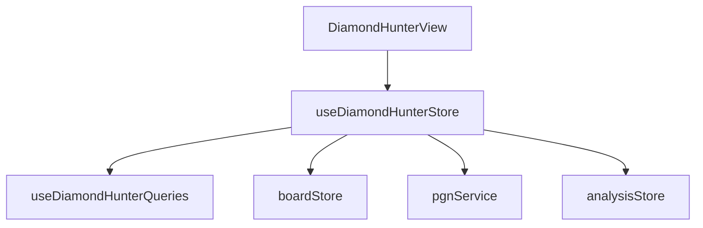

# Логическое ядро: Diamond Hunter

Режим **Diamond Hunter** (Охотник за бриллиантами) — это специализированный тренажер для поиска и фиксации тактических ошибок в дебюте. С технической точки зрения это самый сложный и "авторитарный" режим, жестко управляющий действиями пользователя.

## 1. Схема взаимодействия (Flow)

Процесс разделен на три четкие фазы:

### Фаза А: Охота (The Hunt) - "Гравитационные пути"
1.  **Gravity Bound:** Игрок не обязан ходить строго по стрелкам, но он обязан оставаться внутри "теоретического дерева" Diamond Gravity API. Система показывает топ-3 хода (`weight`), но любой ход, присутствующий в базе для текущей позиции, считается легальным.
2.  **Enforced Theory:** Если игрок делает ход, отсутствующий в Gravity Book, система фиксирует ошибку, автоматически вызывает `pgnService.undoLastMove()` и возвращает позицию назад.
3.  **Weighted Bot:** Бот делает ходы, выбирая их случайным образом из базы Gravity с учетом их веса (популярности).

### Фаза Б: Засада (Solving the Blunder)
1.  **Trigger:** Когда бот выбирает ход с `NAG 4` (грубая ошибка/зевок), игра переходит в состояние `SOLVING`. 
2.  **Tactical Puzzle:** Игрок должен найти опровержение (Punishment).
    - Успех = ход с `NAG 255` (победа) или `NAG 3` (блестящий ход).
    - Ошибка = Принудительный откат до момента ошибки бота.

### Фаза В: Закрепление (Secure & Replay)
1.  **Memory Challenge:** Чтобы "закрепить" бриллиант, игрок нажимает "Secure Diamond".
2.  **Memory Path:** Доска сбрасывается в начальное положение. Игрок должен по памяти повторить всю партию **до момента зевка бота включительно** (состояние `SAVING`).
3.  **Error Correction:** Если игрок ошибается, система откатывает ход (`undo`) и показывает `expected` стрелку.
4.  **Final Punishment:** После "пути до зевка" система возвращается в `SOLVING` для финального наказания.

## 2. Техническая реализация

### Конечный автомат (State Machine)
Управление процессом реализовано через единый **State Enum** (`HunterState`):
- `IDLE` -> `HUNTING` -> `SOLVING` -> `REWARD` -> `SAVING` (также есть состояние `FAILED`).
- **Строгий контроль:** Переходы между состояниями инкапсулированы в методах стора (`startHunt`, `playBlunder`, `completeDiamond`, `startSaveRun`). 
- **Блокировка:** Прямой переход из `HUNTING` в `SAVING` физически невозможен, так как массив `savingMoves` (путь для реплея) формируется только в методе `completeDiamond` после успешного решения тактической задачи в фазе `SOLVING`.

### Сброс контекста и Refresh (F5)
- **Эфемерность:** Текущая сессия "Охоты" является полностью эфемерной. Данные (хэш бриллианта, путь реплея `savingMoves`) хранятся **только в оперативной памяти** Pinia-стора.
- **Риски:** При обновлении страницы (F5) состояние сбрасывается в `IDLE`. Прогресс текущей "поимки" (даже если бриллиант найден, но не "закреплен") будет полностью потерян. Кэширование `diamondHash` в `localStorage` на данный момент не реализовано.

### Архитектура PGN и Изоляция веток
Использование `pgnService.undoLastMove()` для исправления ошибок пользователя классифицируется как "технический долг". 
**Целевое решение для изоляции:**
1. **Validation-first:** Ход пользователя должен валидироваться против Gravity API **до** его добавления в `PgnService`. В случае ошибки ход просто не записывается в историю, а `BoardStore` делает визуальный откат.
2. **Branching (Variations):** Использование встроенной поддержки вариаций в PGN. Ошибочный ход записывается как побочная ветка (variation), которая помечается метаданными `{ type: 'mistake' }` и скрывается из основного UI, сохраняя при этом целостность истории для аналитики.

## 3. Ключевые компоненты

### [Feature] useDiamondHunterStore (`src/features/diamond-hunter/model/diamondHunter.store.ts`)
- Координирует State Machine.
- Реализует `botMove` (переопределяя стандартный `GameStore`).
- Генерирует массив подсказок (`hints`).

### [Database] DiamondDB (`src/db/DiamondDatabase.ts`)
- Хранит персональную коллекцию игрока (IndexedDB).
- Сохраняет `diamondHash`, `FEN` и итоговый `PGN` успешно "закрепленных" бриллиантов.

## 4. Особенности взаимодействия

- **FEN Watcher:** Реактивно отслеживает изменения позиции для обновления стрелок и передачи хода боту.
- **Bot Bypass:** В этом режиме за поведение бота отвечает не `gameplayService`, а логика стора, основанная на весах из Gravity Book.

## 5. Зависимости и FSD-риски

**Критическое замечание для Ревизора:**
Diamond Hunter — самый высокосвязный модуль системы. Он напрямую манипулирует `boardStore` и `pgnService`, что создает риски при обновлении базовых сущностей. Основной технический вызов — миграция с системы "откатов" (`undo`) на систему "предварительной валидации".

## 6. Краткое резюме по Diamond Hunter:

Режим для тренировки "мышечной памяти". Архитектурно сложен из-за многофазности и необходимости вручную управлять PGN-деревом для реализации механики наказания за отклонение от теории.
