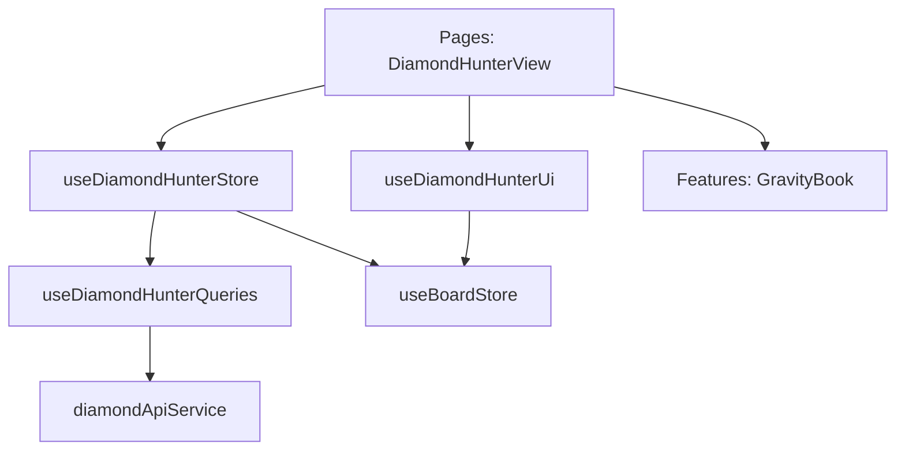

# Логическое ядро: Diamond Hunter

Режим **Diamond Hunter** (Охотник за бриллиантами) — это специализированный тренажер для поиска и фиксации тактических ошибок в дебюте. С технической точки зрения это самый строгий режим, использующий механику "рельс" для управления действиями пользователя.

## 1. Схема взаимодействия (Flow)

Процесс разделен на три фазы:

### Фаза А: Охота (The Hunt)
1.  **Theory Tree:** Игрок обязан оставаться внутри теоретического дерева Diamond Gravity API. Система показывает топ-3 хода в виде разноцветных стрелок.
2.  **Rails Validation:** Если игрок делает ход, отсутствующий в базе, ход блокируется на уровне пре-валидации (`validateUserMove`), фигура "отпрыгивает" назад, а PGN остается чистым.
3.  **Weighted Bot:** Бот делает ходы, выбирая их из базы Gravity с учетом их популярности (`weight`).

### Фаза Б: Наказание (Solving)
1.  **Blunder Trigger:** Когда бот выбирает ход с `NAG 4` (зевок), игра переходит в состояние `SOLVING`. 
2.  **Punishment:** Игрок должен найти опровержение. Валидными считаются только ходы с `NAG 255` (победа) или `NAG 3` (бриллиант). Любые другие ходы блокируются.

### Фаза В: Закрепление (Saving / Replay)
1.  **Memory Challenge:** После успешного решения игрок может нажать "Secure Diamond".
2.  **Memory Path:** Доска сбрасывается. Игрок должен по памяти повторить всю партию до момента зевка включительно.
3.  **Validation:** Ошибки на этом этапе блокируются, система показывает "ожидаемый" ход (`expected`) красной стрелкой.

## 2. Техническая реализация

### Конечный автомат (State Machine)
Управление процессом реализовано через **HunterState**:
- `IDLE` -> `HUNTING` -> `SOLVING` -> `REWARD` -> `SAVING` -> `FAILED`.
- Переходы инкапсулированы в `useDiamondHunterStore`.

### Механика "Рельс" (Guard-Logic)
Валидация происходит **ДО** исполнения хода в `GameStore`:
- `validateUserMove` проверяет UCI-строку против Gravity API.
- Если ход невалиден, возвращается `false`, и `GameStore` не передает ход в `BoardStore` / `PGN`.
- Это гарантирует "стерильность" истории ходов и отсутствие необходимости в `undo`.

## 3. Ключевые компоненты

### [Feature] useDiamondHunterStore (`src/features/diamond-hunter/model/diamondHunter.store.ts`)
- Координирует состояния HunterState.
- Реализует логику бота и выборку кандидатов.
- Генерирует массив `hints` (подсказки) для визуализации.

### [UI] useDiamondHunterUi (`src/features/diamond-hunter/ui/useDiamondHunterUi.ts`)
- Реактивно отслеживает `hints` и отрисовывает стрелки на доске через `boardStore.setDrawableShapes`.

### [Database] DiamondDatabase (`src/features/diamond-hunter/api/DiamondDatabase.ts`)
- Инкапсулирует работу с IndexedDB для хранения локальной коллекции бриллиантов игрока.

## 4. Особенности взаимодействия

- **Sound Feedback:** Использует `soundTrigger` для мгновенной аудио-реакции на ошибки или успех.
- **Integration:** После завершения или при окончании теории пользователю предлагается переход в `AnalysisPanel`.

## 5. Зависимости и структура (FSD)

**Резюме:**
Diamond Hunter является вершиной реализации "управляемого геймплея" в системе. Благодаря пре-валидации ходов ("рельсам"), режим обеспечивает жесткую дисциплину обучения без замусоривания PGN-истории ошибочными попытками.
