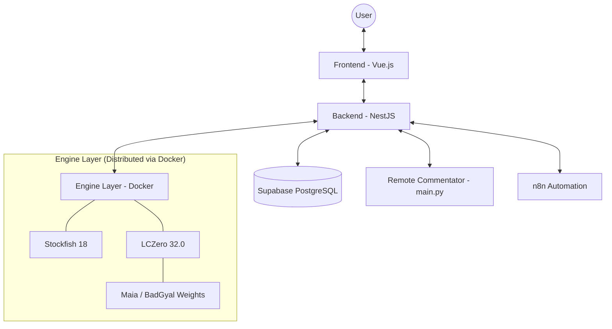

# 3. Architecture Overview

The Chess App is built on a distributed, microservice-inspired architecture that separates the heavy computational load of chess engines from the user-facing interface and management logic.

## System Workflow
The diagram below illustrates the high-level interaction between the main components when a user performs an action (e.g., requests an analysis or starts a sparring session).

## Component Responsibilities

### 1. Frontend (Public)
The user gateway. It handles chessboard rendering using **Chessground**, manages local move validation via **Chessops**, and communicates with the backend via REST APIs.
- **State Management**: Uses Pinia to keep track of the current game state, user balance (FanCoins), and UI settings.
- **Service Workers**: Utilized for performance and offline capabilities where applicable.

### 2. Backend (Service Hub)
The central orchestrator of the system.
- **Task Delegation**: When a move needs analysis, the backend decides which engine to invoke based on the current game mode (e.g., Maia for "human-like" moves, Stockfish for absolute truth).
- **Session & Economy**: Tracks user progress, handles authorization via Lichess OAuth (or tokens), and manages the **FanCoins** transaction logic.
- **Database Coordination**: Uses TypeORM to interact with Supabase for persistent data and local SQLite for fast-access caching.

### 3. Engine Layer (Compute)
A cluster of Docker containers optimized for chess computation.
- **Isolation**: Each engine instance runs in its own environment, preventing resource contention.
- **Weight Management**: LCZero instances are dynamically loaded with the appropriate weight files (`maia-2200.pb.gz`, `badgyal-8.pb.gz`, etc.) depending on the desired sparring level.

### 4. Remote Intelligence (`brilliant_move`)
A specialized Python module (`main.py`) that acts as a real-time commentator.
- **MozerBook Integration**: Queries the opening theory database to provide feedback on whether a move is "book", "mistake", or "brilliant".
- **Sparring Logic**: Controls the flow of the "Open Sparring" mode, providing tactical hints and positional evaluation summaries.

## Data Persistence
- **Global Store**: Supabase (PostgreSQL) stores user profiles, tactical ratings, and the "Hall of Fame" leaderboards.
- **Local Cache**: The backend uses SQLite/Cache-manager for storing temporary evaluations and session data to reduce engine load and API latency.

---
*Back to: [Technical Stack](./02_Technical_Stack.md) | Next Chapter: [Finish Him (Game Mode)](./04_GameMode_Finish_Him.md)*
